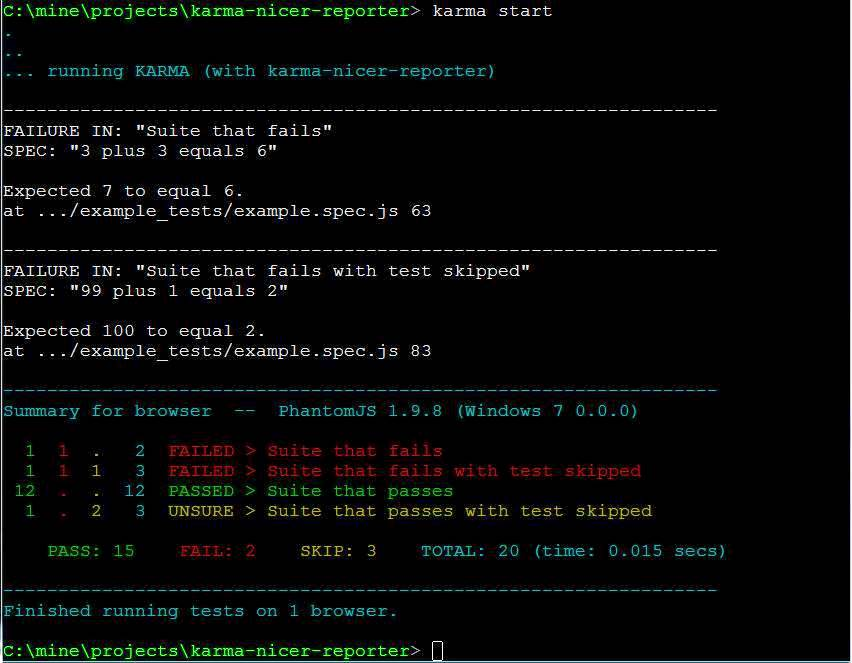

A nicer reporter for [Karma](http://karma-runner.github.io/0.13/index.html).

#What is this?

A __"nicer"__ reporter for [karma test runner](http://karma-runner.github.io/0.13/index.html) designed to show you what you need to know at a glance:

  - Only prints details for failed tests
  - Color-coded summary passed/failed/skipped per suite
  - Shortens URLs of files in error message print out

### Example screenshot

  

(Taken from ConEmu on Windows)

#Installation

    npm install karma-nicer-reporter --save-dev
    
#Usage

In your karma configuration file include __nicer__ as a (or the) reporter.

    ...
    reporters: ['nicer'],
    ...
    
#Configuration

Adding a __nicerReporter__ entry in your karma configuration file, you can override the default colors (which come from [chalk](https://github.com/chalk/chalk)).

    ...
    nicerReporter : {
      defaulColor: 'cyan',
      successColor: 'green',
      failColor: 'red',
      skipColor: 'yellow',
      errorLogColor: 'white'
    }
    ...

#Development

There is an example __karma.conf.js__ and some example specs you can run to see the output. These are best run using:

    gulp test
    
Which overwrites __index.js__ in the __node_modules__ folder before running __karma start__.

Pull requests welcome.

#Roadmap

One feature missing is times for individual tests, which isn't there because we don't print individual tests unless they fail. Perhaps it could be included as a second runner.

Also, this has only been tested with:

    autoWatch: false,
    singleRun: true,

And not in any CI enviroment.

#Licence

MIT

